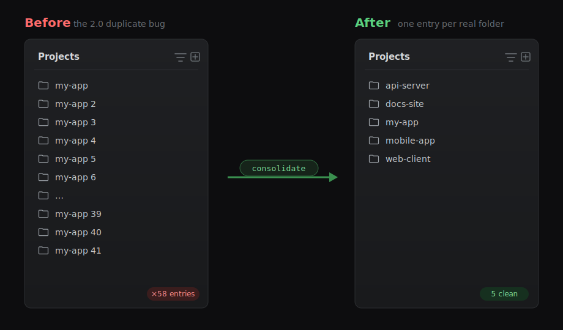
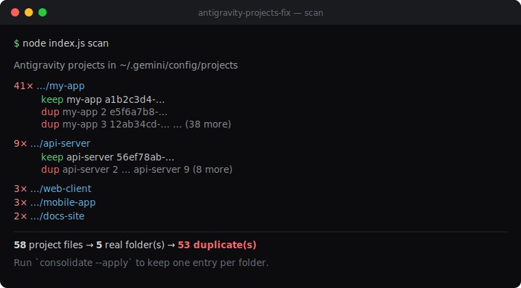
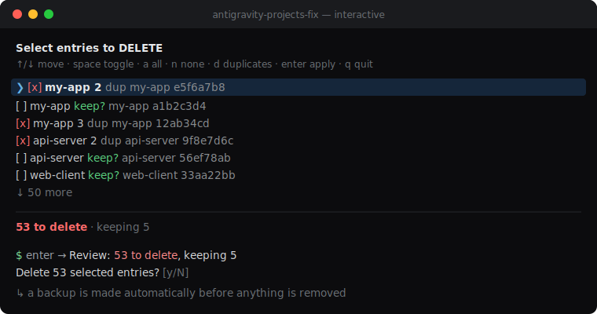

<div align="center">

# 🛸 antigravity-projects-fix

### Clean up the **Google Antigravity 2.0** "duplicate projects" mess in one command.

When one project folder shows up in the sidebar as `MyApp`, `MyApp 2`, `MyApp 3` … all the way to `MyApp 41`, this tool collapses them back to a single, tidy entry.

[](LICENSE)
[](https://nodejs.org)
[](package.json)
[](#-contributing)

<br/>



</div>

---

## 📑 Table of contents

- [Introduction](#-introduction)
- [What is this?](#-what-is-this)
- [The problem](#-the-problem)
- [Why does it happen?](#-why-does-it-happen)
- [The solution](#-the-solution)
- [Installation](#-installation)
- [Usage](#-usage)
- [Where are the files? (auto-detect)](#-where-are-the-files-auto-detect)
- [The result](#-the-result)
- [Safety](#-safety)
- [Will the duplicates come back? (cloud sync)](#-will-the-duplicates-come-back-cloud-sync)
- [Limitations](#-limitations)
- [Contributing](#-contributing)
- [License & disclaimer](#-license--disclaimer)

---

## 👋 Introduction

[Google Antigravity](https://antigravity.google) is Google's agentic, AI‑first IDE
(a fork of VS Code). It's great — until you update to **2.0** and discover your
**Projects** sidebar has quietly multiplied. A single repository you've opened a
few times suddenly appears **dozens of times**, each with a number — `2`, `3`,
… `41` — tacked on the end.

Deleting them one by one is hopeless when there are 40+ copies of one folder, and
there's no "remove all" button. **This tool fixes that in seconds** — safely,
with a dry‑run preview and an automatic backup.

## 🔎 What is this?

`antigravity-projects-fix` is a tiny, **zero‑dependency Node.js command‑line tool**.
It reads Antigravity's local project registry, groups the entries by the *real*
folder each one points to, and lets you:

- **`scan`** — see exactly how bad the duplication is (read‑only)
- **`interactive`** — a checkbox UI to pick *exactly* which entries to delete
- **`consolidate`** — keep **one** entry per folder, delete the rest
- **`purge`** — wipe **all** project entries for a clean slate
- **`restore`** — undo, from an automatic backup

No installer, no npm packages, no network calls. One file, runs anywhere Node runs.

> ℹ️ Unofficial community project. **Not affiliated with Google LLC.**

> ⚠️ **Platform support — please read.** This has been **tested on Windows only.**
> macOS (Apple Silicon **and** Intel) and Linux are supported in the code but are
> **not yet tested on real hardware.** If you're on a Mac, please be careful:
> run `scan` first (read‑only, changes nothing), and keep the **automatic backup**
> so you can `restore` if anything looks wrong. Reports from macOS/Linux are very
> welcome — see [Discussions](https://github.com/ryukenshin546-a11y/antigravity-projects-fix/discussions).

## 🐛 The problem

After the 2.0 update, the Projects panel looks like this:

<div align="center">

</div>

```text
Projects
 📁 my-app
 📁 my-app 2
 📁 my-app 3
 ...
 📁 my-app 41      ← 41 copies of ONE folder
```

Every numbered item opens the **exact same directory**. The list becomes
unusable, and clearing the local SQLite/state files doesn't help because that's
not where this list lives.

## 🧠 Why does it happen?

Antigravity identifies each workspace by a generated **UUID**, *not* by its folder
path. During the 2.0 migration / cloud re‑sync it keeps minting a **brand‑new
UUID for the same folder** instead of reusing the existing one. Each new UUID
becomes another sidebar entry, and the UI appends `2`, `3`, … to tell the
identical names apart.

The panel is rendered from **one JSON file per entry** here:

```text
~/.gemini/config/projects/<uuid>.json
```

A real example — note that **41 of these files carry the same `folderUri`**:

```json
{
  "id": "0381f70c-d691-4bd0-bd02-0ec63f39d168",
  "name": "my-app 19",
  "projectResources": {
    "resources": [
      { "gitFolder": { "folderUri": "file:///home/user/code/my-app" } }
    ]
  }
}
```

This tool reads that folder, groups entries by their normalized `folderUri`, and
collapses the duplicates.

## ✨ The solution

Point the tool at your machine and let it report the damage first:

<div align="center">

</div>

Then `consolidate --apply` to keep one entry per folder (a backup is made first),
or `purge --apply` for a clean slate.

## 📦 Installation

Requires **Node.js ≥ 16.7** (for `fs.cpSync`). No `npm install` needed.

```bash
# Option A — clone and run
git clone https://github.com/ryukenshin546-a11y/antigravity-projects-fix.git
cd antigravity-projects-fix
node index.js scan

# Option B — run without cloning
npx antigravity-projects-fix scan
```

## 🚀 Usage

```text
antigravity-projects-fix <command> [options]
```

### Which command should I use?

| Your goal                                     | Command                  |
| --------------------------------------------- | ------------------------ |
| Just look — change nothing                    | `scan`                   |
| Keep my projects, drop only the duplicates    | `consolidate --apply`    |
| Choose exactly what to delete / keep          | `interactive`            |
| **Delete everything — start fresh**           | `purge --apply`          |
| Undo a previous run                           | `restore <backup-dir>`   |

> All destructive commands are **dry‑run by default**, make an **automatic backup**,
> and **ask for confirmation** before deleting. Close Antigravity first.

### Commands

| Command            | What it does                                                   |
| ------------------ | ------------------------------------------------------------- |
| `scan` *(default)* | List projects grouped by folder and count the duplicates      |
| `interactive`, `i` | **Checkbox UI** — tick exactly which entries to delete         |
| `consolidate`      | Keep **one** entry per folder, remove the duplicates           |
| `purge`            | Remove **every** project entry (clean slate)                   |
| `restore <dir>`    | Copy project files back from a backup folder                  |

### Interactive mode (recommended)

Antigravity itself has **no multi‑select** and takes ~3 clicks to remove a single
project. This mode fixes that: one screen, tick everything you want gone, keep the
rest, apply once.

```bash
node index.js interactive
```

<div align="center">

</div>

- **↑ / ↓** (or `j` / `k`) — move
- **Space** — toggle the row
- **a** — select all · **n** — select none · **d** — select all duplicates (the default)
- **Enter** — review, then confirm before anything is deleted
- **q** / **Esc** — quit without changing anything

Duplicates are pre‑selected for you (one keeper per folder stays unchecked), so for
the common case you can just press **Enter**. Nothing is deleted until you confirm,
and a backup is always made first.

### Options

| Option          | Description                                                            |
| --------------- | --------------------------------------------------------------------- |
| `--apply`       | Actually perform the change (`consolidate`/`purge` preview without it) |
| `-y, --yes`     | Skip the confirmation prompt                                           |
| `--no-backup`   | Do not create a backup before deleting                                |
| `--force`       | Skip the "is Antigravity running?" safety check                       |
| `--dir <path>`  | Override the projects folder (otherwise it's [auto-detected](#-where-are-the-files-auto-detect)) |
| `--no-color`    | Disable colored output                                                |
| `-h, --help`    | Show help                                                             |
| `-v, --version` | Show version                                                          |

### Examples

```bash
# Pick exactly what to delete in a checkbox UI (recommended)
node index.js interactive

# 1. See what's going on (read-only, changes nothing)
node index.js scan

# 2. Preview the consolidation
node index.js consolidate

# 3. Collapse duplicates to one entry per folder (backs up first)
node index.js consolidate --apply

# 4. Nuke every project entry, no prompt
node index.js purge --apply --yes

# 5. Undo — restore from a backup
node index.js restore ~/.gemini/config/projects.backup-2026-05-20_06-32-10
```

## 📍 Where are the files? (auto-detect)

The project registry **isn't in the same place on every machine.** Its location
depends on your OS, your Antigravity version, environment overrides, and where
Electron put its user-data directory. Hard-coding one path would make the tool
report *"no projects found"* on a perfectly affected machine — so instead it
**auto-detects.**

On startup (when you don't pass `--dir`) it probes these locations **in order**
and uses the **first one that actually contains project files** (a `.json` with a
`folderUri` inside):

| Order | Location                                                      | When it applies        |
| ----- | ------------------------------------------------------------ | ---------------------- |
| 1     | `$GEMINI_HOME/config/projects`                               | explicit env override  |
| 2     | `~/.gemini/config/projects`                                  | current default        |
| 3     | `$XDG_CONFIG_HOME/gemini/config/projects` · `~/.config/gemini/config/projects` | Linux            |
| 4     | `%APPDATA%\Antigravity\config\projects` · `%LOCALAPPDATA%\…` | Windows (Electron)     |
| 5     | `~/Library/Application Support/Antigravity/config/projects`  | macOS                  |

- If detection lands somewhere **other than the default**, the tool prints
  `Using detected projects folder: …` so you can see exactly what it's touching.
- If **nothing** matches, it **lists every path it checked** and tells you to
  point `--dir` at the right one — it never fails silently.
- You can always **skip detection** with `--dir`:

  ```bash
  node index.js scan --dir "/custom/path/.gemini/config/projects"
  ```

> 💡 Not sure where yours is? Run `node index.js scan` first — it either finds it
> or shows you the list of places it looked.

## ✅ The result

A real run on a machine with the bug:

```text
58 project files  →  5 real folder(s)  →  53 duplicate(s)
```

| Before               | After                         |
| -------------------- | ----------------------------- |
| 58 sidebar entries   | **5** (one per real folder)   |
| 41× `my-app`         | **1×** `my-app`              |
| 9× `api-server`      | **1×** `api-server`          |
| unusable panel       | clean, navigable panel        |

Reopen Antigravity and the Projects panel is back to normal.

### Which entry is kept?

For `consolidate`, the keeper per folder is chosen as: the name **without** a
numeric suffix first (e.g. `my-app` over `my-app 19`), then the shortest name,
then the oldest file.

## 🛡️ Safety

This tool is built to be hard to misuse:

- **Dry‑run by default** — `consolidate` and `purge` only print a preview until
  you add `--apply`.
- **Automatic backup** — before deleting, the whole `projects` folder is copied to
  `projects.backup-<timestamp>` right next to it (skip with `--no-backup`).
- **Backup must succeed first** — if the backup can't be written (disk full,
  permissions), the tool **aborts before deleting anything** rather than risk
  unprotected data.
- **Won't fight the app** — it refuses to run while `Antigravity` is detected as
  running (override with `--force`). **Close Antigravity first.**
- **Won't touch the wrong folder** — auto-detection only picks a directory that
  actually contains project files, and `--dir` is validated (it must be a real
  directory). Malformed JSON files are reported and skipped, never guessed at.
- **Fully reversible** — `restore <backup-dir>` puts everything back.
- **Offline** — it only touches local files and never makes a network request.

## ☁️ Will the duplicates come back? (cloud sync)

Antigravity syncs workspace data to your Google account. Local cleanup sticks in
most cases, but if entries reappear after reopening, the duplicates are being
re‑synced from the server. In that case you can:

- remove them from inside the app, **or**
- wait for an official fix (this is a known 2.0 migration bug), **or**
- re‑run this tool after a sync as a stopgap.

## ⚠️ Limitations

- v1 operates on the project **registry** (`~/.gemini/config/projects`). It does
  not re‑map conversations that were attached to a removed duplicate UUID, so
  after `consolidate` a few old conversations may not appear grouped under the
  surviving project. **Your conversation data itself** (in
  `~/.gemini/antigravity/conversations`) **is never touched.**
- **Tested on Windows only.** macOS (Apple Silicon & Intel) and Linux use the same
  code paths (`~/.gemini`, `pgrep`) and *should* work — but they are **unverified on
  real hardware.** On those systems, treat it as experimental: run `scan` first,
  rely on the automatic backup, and please report results in an issue or discussion.

## 🤝 Contributing & feedback

There are a few ways to get involved:

- 🐛 **[Open an issue](https://github.com/ryukenshin546-a11y/antigravity-projects-fix/issues/new/choose)** — report a bug or request a feature (guided templates).
- 💬 **[Start a discussion](https://github.com/ryukenshin546-a11y/antigravity-projects-fix/discussions)** — questions, ideas, or general feedback.
- 🔀 **Open a pull request** — fork, change, and submit; a PR template will guide you.
- ⭐ **Star the repo** if it helped you.

Especially welcome:

- testing on macOS / Linux,
- findings about how/when cloud sync re‑creates entries,
- optional conversation re‑mapping during `consolidate`.

## 📄 License & disclaimer

Released under the [MIT License](LICENSE).

This is an independent, community‑made utility. It is **not affiliated with,
endorsed by, or supported by Google LLC**. "Antigravity" and "Google" are
trademarks of their respective owners. Use at your own risk — though the
dry‑run‑by‑default and automatic backups are there to keep you safe.
